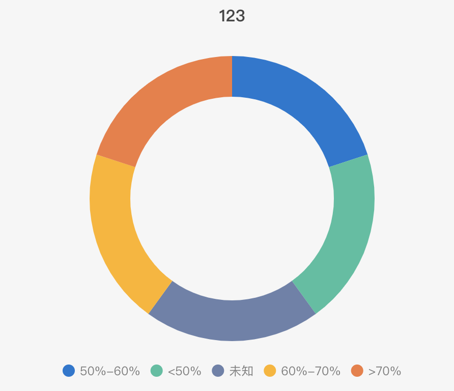

# ECharts画饼图（vue组件）



```
<template>
    <div ref="pie" style="width: 400px; height: 400px"></div>
</template>

<script lang="ts">
import * as echarts from 'echarts';
import { Component, Model, Prop, Vue, Watch, Ref } from 'vue-property-decorator';

@Component
export default class PieChart extends Vue {
    @Prop({ type: Object }) data: any;
    @Prop({ type: Object }) lengend: any;
    @Prop({ type: String }) title?: string;

    @Ref('pie') pieDom!: HTMLElement;
    charts: any = '';

    mounted() {
        this.drawPie(this.pieDom);
    }

    drawPie(dom) {
        this.charts = echarts.init(dom);
        this.charts.setOption({
            tooltip: {
                trigger: 'item',
            },
            color: ['#0F77D2', '#3FC0A0', '#6C81AA', '#FFB40C', '#F37B3F'],
            legend: {
                bottom: '5%',
                left: 'center',
                icon: 'circle',
                data: this.lengend,
                itemWidth: 12,
                textStyle: {
                    fontSize: '12',
                    color: '#7F7F7F',
                },
            },
            title: {
                text: this.title,
                x: 'center',
                y: '7px',
                textStyle: {
                    fontSize: '16',
                },
            },
            series: [
                {
                    type: 'pie',
                    radius: ['50%', '70%'],
                    avoidLabelOverlap: false,
                    label: {
                        normal: {
                            show: false,
                            position: 'center',
                        },
                        emphasis: {
                            show: true,
                            textStyle: {
                                fontSize: '12',
                            },
                        },
                    },
                    labelLine: {
                        normal: {
                            show: false,
                        },
                    },
                    data: this.data,
                },
            ],
        });
    }
}
</script>

<style lang="scss"></style>

```